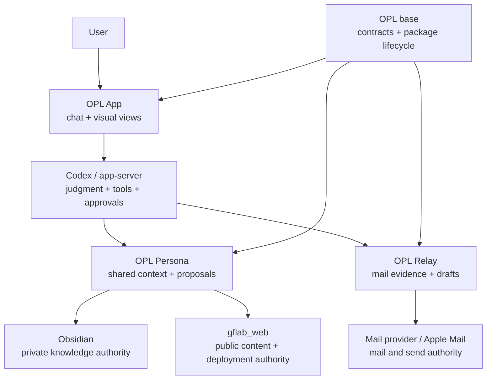

# OPL Personal Communication and Persona Architecture

Status: active design guidance, v1

This document is the cross-repository design authority for the personal
communication and PI digital-persona surfaces. It defines ownership and
integration boundaries; it is not a promise that every planned UI, adapter, or
external write is already released.

## Product intent

The product is a personal communication and knowledge delegate:

> Evidence from the user's systems, private memory for continuity, Obsidian for
> personal knowledge, and Codex for judgment and drafting.

The long-term user-facing product is **OPL App**. It is a chat-first host with
visual management surfaces for mail, memory, knowledge, proposals, research,
and other work. A separate Persona-specific desktop shell is not a product
goal. Domain capabilities remain independently installable and usable.

The public product model is intentionally small:

```text
OPL base       runtime, package discovery, contracts, lifecycle, execution
OPL App        user-facing host, chat, navigation, views, approvals
OPL Packages   installable domain capabilities such as Relay and Persona
```

Codex CLI, Codex App, and `app-server` are execution surfaces used by the
platform. They are not additional domain authorities. Shell implementation is
an OPL App delivery concern, not a new product layer.

## System shape



The arrows describe calls or proposal flows, not ownership transfer. Each
system keeps its own source of truth.

## Repository and authority map

| Repository or system | Owns | Does not own |
| --- | --- | --- |
| `one-person-lab` | Generic Package contracts, discovery, projections, lifecycle | Mail, Persona, website, or UI business state |
| `one-person-lab-app` | App product contract, page state, contribution consumption, acceptance | Domain data, mail semantics, website deployment |
| `opl-aion-shell` | Desktop renderer/process/package implementation | Product contracts or domain authority |
| `opl-relay` | Mail identities, evidence, relationship memory, draft lifecycle, send receipts | Persona orchestration, website CMS, Obsidian vault |
| `opl-persona` | PI context, provenance, cross-domain proposal shape and proposal state | Mail store, private vault, website source, credentials |
| `gflab_web` | Public publication/news source, Hugo build, deployment source | Private Persona state or mail state |
| Obsidian vault | Private notes and technical memos | Public website or mail delivery |
| Mail provider / Apple Mail | Mailbox and final send state | Persona proposal state |

Do not create separate repositories for a Relay UI, Persona UI, shared core,
or one repository per adapter. These are integration surfaces or owner-owned
modules, not independent product lifecycles.

## Data and installation boundary

Code and private data are physically separate:

```text
/Users/gaofeng/workspace/
├── opl-relay/          # source, plugin, package, tests, docs
├── opl-persona/        # source, plugin, package, tests, docs
├── one-person-lab/     # OPL base contracts and runtime
├── one-person-lab-app/ # App product and contracts
├── opl-aion-shell/     # desktop implementation
└── gflab_web/          # website source and deployment configuration

~/.opl-relay/           # Relay private runtime data
~/.opl-persona/         # Persona private runtime data
  └── workspaces/default/
```

The exact home directory is configurable through `OPL_RELAY_HOME`,
`OPL_RELAY_WORKSPACE`, `OPL_PERSONA_HOME`, and `OPL_PERSONA_WORKSPACE`.
Obsidian remains an external, user-selected vault. A checkout, installed
plugin, Package cache, generated fixture, or task worktree is never a data
authority.

Private mail, raw EML, SQLite stores, relationship memory, Obsidian contents,
credentials, and runtime cursors must never enter Git.

## Domain boundaries

### OPL Relay

Relay is the independently useful communication capability. It provides:

- IMAP synchronization and stable mail identities;
- raw EML evidence and bounded retrieval;
- evidence-backed relationship-memory lifecycle;
- Obsidian indexing as a read-only input;
- Apple Mail draft creation, review, fingerprinting, and send receipts.

Relay may consume a Persona mail-context proposal, but it does not let Persona
create or send a message without the existing Relay review contract.

### OPL Persona

Persona is the cross-domain PI context and judgment boundary. It combines
evidence-backed inputs from Relay, Obsidian, and the website domain into
reviewable proposals. It does not become a second database for any of them.

The v1 proposal routes are:

```text
publication input
  -> knowledge.ingest proposal
  -> gflab_web.content.publication proposal

Obsidian technical memo
  -> gflab_web.content.post proposal
  -> opl-relay.draft.context proposal
```

Persona can maintain proposal state and provenance, but an accepted proposal is
still not an external write until the owning adapter executes it and reads back
the resulting authority.

### OPL App and Shell

OPL App consumes Package descriptors through the role-neutral
`app_contributions` contract. It renders navigation, standard view kinds,
read-model references, commands, and approval surfaces. The App must not
special-case `opl-relay` or `opl-persona`, force either package into a
`standard_agent` role, or implement a second mail engine.

The first reusable view kinds are:

```text
list_detail   timeline   approval_diff   task_board
artifact_view activity_log
```

The Shell renders the App contract. It should not invent domain semantics or
persist a shadow copy of Package state.

The deferred implementation plan for role-neutral capability management and
unified approval views is in
[OPL App Capability Management and Unified Approval Plan](deferred-opl-app-capability-management.md).

## Proposal-first mutation model

Every cross-system write follows this lifecycle:

```text
source evidence
  -> Persona context and provenance
  -> explicit proposal
  -> user review and approval
  -> owner adapter
  -> authoritative write
  -> fresh readback and receipt
```

The default proposal policy is:

```json
{
  "approval": {
    "required": true,
    "external_write_allowed": false
  }
}
```

Therefore these are distinct states:

- proposal generated;
- proposal approved;
- website content applied;
- mail draft saved;
- mail sent and found in Sent;
- website deployed and publicly read back.

No candidate, dry-run, local build, queued action, or generated draft is a
substitute for the final authority readback.

## Plugin and Package surfaces

Each domain repository may provide three related surfaces:

1. **Core** — stable domain actions, read models, evidence, and safety rules.
2. **Codex Plugin** — Skills, discovery metadata, and thin integration helpers.
3. **OPL Package** — capability metadata and declarative App contributions.

The Plugin and Package are carriers. They must not own private state, secrets,
or an alternate database. The OPL platform owns installation and lifecycle;
the domain Core owns domain semantics; OPL App owns rendering.

## Current implementation phase

The first vertical slice is intentionally conservative:

1. Relay Core, Plugin, Package, and Apple Mail review lifecycle are available.
2. Persona Core, Plugin, Package, and proposal contracts are available.
3. The `gflab_web` adapter is proposal-only and does not edit content or deploy.
4. Relay can read Persona mail-context proposals without creating or sending a
   message.
5. OPL App has Persona contribution fixtures and contract tests; production
   navigation and Shell rendering remain separate acceptance gates.

The next implementation work should connect these existing surfaces through
fresh installation and runtime readback. It must not weaken proposal approval or
move domain authority into OPL App.

## Change rules

Before adding a module, ask:

1. Is this a new authority or only a projection of an existing one?
2. Can the current owner, native platform, or Package contract do it already?
3. Does the change require a new repository, or is it an adapter in an existing
   owner repository?
4. Does it create a second copy of private state or a second mutation path?
5. What exact approval, evidence, and readback prove completion?

Prefer the smallest owner-owned implementation. New cross-domain behavior
belongs in Persona only when it is judgment/provenance/proposal coordination;
mail, website, knowledge-vault, and desktop rendering behavior stays with its
existing authority.
