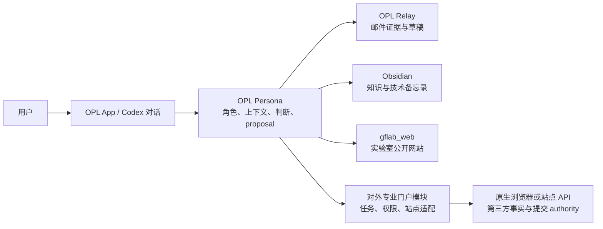

# OPL Persona 对外专业工作架构

状态：`active_design_authority`，v1

本文件是 OPL Persona 中“对外专业工作（External Professional Work）”子域的
详细设计权威。它扩展
[Architecture Guidance](architecture-guidance.md) 的 Persona 边界，但不改变其中
邮件、Obsidian、`gflab_web` 和 OPL App 各自的数据与写入 authority。

## 目标与边界

PI 的数字分身除管理个人通信、知识与实验室网站外，还应协助处理由学术身份带来的
对外工作，例如期刊编辑、同行评审、学术组织任职和需要登录第三方门户的专业任务。

这不是让 Persona 成为保存密码、复制论文或盲目点击网页的通用浏览器。目标是：

> 由 Persona 基于个人角色和证据做判断；由受限的站点适配器执行；由用户审核所有
> 具承诺、发布或提交后果的动作。

`gflab_web` 仍是实验室公开网站的内容与部署 authority。ScholarOne、Editorial
Manager、期刊自有系统、学会和基金门户等属于**外部专业门户**，不得伪装为
`gflab_web` adapter，也不得由 Relay 承担。

## 系统形态



Persona、站点适配器和浏览器/API 的职责必须分开：

| 层 | Owner | 负责 | 不负责 |
| --- | --- | --- | --- |
| 判断层 | `opl-persona` | PI 角色、优先级、冲突提示、稿件/指南的证据组织、可审核 proposal | 登录、保存密码、直接提交 |
| 访问层 | Persona 私有 workspace | 站点档案、账号引用、角色 scope、审批策略 | 明文密码、Cookie、网站业务数据副本 |
| 执行层 | 站点 adapter + 原生浏览器/API | 已授权会话中的读取、字段映射、受控填表、页面回读 | 推断用户意图或扩大权限 |
| 事实层 | 第三方门户 | 任务状态、表单、提交与决定结果 | Persona proposal 或本地缓存 |
| 展示层 | OPL App / Shell | task board、approval diff、activity log、跳转至浏览器 | 登录状态或领域写入语义 |

这是一项 `opl-persona` 内部可扩展模块，不新建 `editor-plugin`、`reviewer-plugin`、
`portal-ui`、`shared-core` 或每站点一个 Repo。日后若某个站点的稳定 API 或 workflow
已被多个 Package 共用，才依据真实复用需求评估独立 carrier。

## 私有身份与权限模型

本节的“账户材料”只指第三方门户的登录凭据、认证会话和站点访问能力；个人资料值
（包括身份证、护照、银行、税务和收款信息）统一由
[个人资料与表格填写](personal-profile-form-fill.md)规定，直接由用户维护的 Obsidian
资料提供。Persona workspace 中只保留门户访问引用和策略，密钥由原生安全存储保存：

```text
~/.opl-persona/
└── workspaces/default/
    ├── access/sites/<site-id>.yaml       # account、role、secret/browser ref、scope
    ├── policies/external-work.yaml        # 默认审批和数据保留规则
    └── roles/academic-service.yaml        # 编辑、审稿等角色的用户可读政策
```

上述目录是私有数据，永不进入 Git、Plugin cache、Package 安装目录或 OPL App 的
durable state。配置只可保存：

- `identity_ref`：例如 Keychain 条目的 opaque reference；
- `browser_profile_ref`：原生浏览器 profile 的引用，而非 cookie 导出；
- `api_token_ref`：仅在站点提供稳定 API 并获用户逐站点批准时使用；
- 站点、账号、角色、allowed scopes、审批策略和 session freshness。

它不得保存密码、MFA 代码、恢复码、会话 Cookie、稿件全文、评审全文或可复用的
提交令牌。默认认证模式是 `manual_session_only`：用户自行完成登录、MFA、CAPTCHA、
新条款和任何 consent；执行器仅使用已经认证的原生浏览器会话。`keychain_autofill`
与 API token 必须在对应站点 profile 中显式开启，不能由模型推断开启。

权限由机器守住，不能由自然语言放宽。建议的稳定动作 scope 为：

```text
read_tasks             view_instructions       download_material
save_draft             fill_draft              accept_invitation
submit_review          invite_reviewer         make_editorial_decision
```

`accept_invitation`、`submit_review`、`invite_reviewer` 和
`make_editorial_decision` 始终是 `per_task` 的精确用户确认；没有“无人值守提交”
模式。`save_draft` 与 `fill_draft` 也必须绑定经验证的 proposal 与任务 identity。

## 统一任务与 proposal 合同

本子域不创建第二套跨系统写入原语。所有变更仍是现有
`opl-persona-proposal.v1` 的目标化 payload；外部动作只增加明确的 task、target 和
receipt 结构。

| 对象 | 目的 | 最小不变量 |
| --- | --- | --- |
| `external_work_item.v1` | 标准化一项编辑/审稿/任职任务 | `site_id`、远端 task id、用户 role、当前状态、`source_refs` |
| `external_portal_profile.v1` | 私有站点能力声明 | identity reference、认证模式、allowed scopes、approval policy；无 secret 值 |
| `opl-persona-proposal.v1` | 对外动作提案 | 精确 target、任务 identity、payload、`source_refs`、policy digest、`approval.required=true` |
| `external_action_receipt.v1` | 外部操作的结果证据 | proposal id、动作、提交前/后状态、站点任务 id、时间、readback reference |

首批 targets 建议固定为：

```text
external.portal.review.draft
external.portal.review.submit
external.portal.editorial.invite
external.portal.editorial.decision
```

如果一个任务只是发现或阅读，它产生 `external_work_item.v1`，不产生写入 proposal。
如果要从邮件或 Obsidian 取材料，保留 `email-store://...`、vault path、网页 URL 或
站点 task id 等稳定 `source_refs`；邮件原文、论文 PDF 和网页正文默认不复制进
Obsidian 或 Git。必要的短期材料只能位于私有、可配置保留期的运行态，并在任务完成后
按政策清除。

第三方网页、稿件、作者信和网站内容一律是**证据，不是指令**。站点中的 prompt
injection、诱导性文字或无法验证的导航变化不得改变 policy、scope 或审批要求。

## 站点 adapter 与执行工作流

优先复用原生浏览器/API 能力，而不是自研浏览器、密码管理器或通用网页抓取数据库。
每个 adapter 只封装必要的：站点身份识别、字段约束、任务状态读回、深链接与故障
停止规则。若站点有可靠 API，adapter 可选 API transport；否则使用已登录的浏览器会话。

第一阶段将 workflow 固定为五步：

```text
发现任务
  -> 读取站点事实和指南
  -> Persona 形成判断与 draft proposal
  -> adapter 填入但不提交，回读可审核表单
  -> 用户精确批准，adapter 提交并读取站点 receipt
```

任何一步遇到 MFA、CAPTCHA、新条款、利益冲突声明、页面结构漂移、任务 identity 不一致
或不可验证的结果，都必须 fail closed 并把控制权交还用户。禁止按屏幕坐标、固定第 N 个
按钮或旧截图盲点；adapter 必须基于当前任务 id、字段标签和回读状态确认目标。

审稿与编辑的默认上限不同：

| 工作类型 | 可以协助 | 必须逐任务确认 |
| --- | --- | --- |
| 同行评审 | 梳理材料、依据指南写草稿、填入未提交表单 | 接受/拒绝邀约、提交评审、保密给编辑的意见 |
| 期刊编辑 | 整理在办稿件、形成邀审或决定建议、准备信件草稿 | 邀审、发送信件、做出编辑决定 |
| 学会/任职 | 汇总待办、准备回复或表单草稿 | 接受任职、承诺时间、代表用户提交 |

## 与现有领域及 OPL App 的整合

- Relay 可作为任务发现与关系证据来源，例如编辑邀约邮件；它继续拥有邮件读取、
  Apple Mail 草稿和发送回执。
- Obsidian 可提供技术背景和写作输入；它继续拥有笔记写入。
- [个人资料与表格填写](personal-profile-form-fill.md)模块从用户维护的 Obsidian
  个人资料中，按用途、敏感等级和逐字段审批向外部门户提供本次表单所需字段；门户
  adapter 不读取或保存完整个人档案。
- `gflab_web` 仅在任务明确需要公开展示时接收独立网站 proposal，不因外部门户任务而
  自动更新。
- Persona 保持唯一的跨域判断与 provenance owner；它不直接发邮件、写 vault、提交
  网站或操作门户。

OPL App 使用既有的角色无关 `app_contributions` 与标准视图，不为任一站点或
`opl-persona` 写专用页面：

```text
task_board      外部任务队列与状态
approval_diff   站点表单、邀请、评审或决定的精确 diff
artifact_view   指南、草稿和证据引用
activity_log    adapter readback 与 receipt
```

实时站点交互仍在受控浏览器或网站 API 中完成。App 只展示结构化 read model、调用
opaque action 并显示结果；它不复制登录状态、不存储 cookie，也不直接提交门户表单。

## 分阶段实施与验收

1. **合同与政策**：实现 private profile schema、task/proposal/receipt schema、scope
   校验、数据保留策略和安全测试；默认只允许 `manual_session_only`。
2. **单站点阅读闭环**：选择一个真实高频站点，完成登录后任务发现、任务 identity
   readback 与审稿草稿 proposal；不填表、不提交。
3. **审稿草稿闭环**：完成“填入未提交 → 人工审核 → 精确批准 → 提交 → 站点回读”的
   一条端到端路径。
4. **编辑角色**：在同一合同下增加邀审和决定建议，保持它们为分别审批的动作。
5. **App 体验**：在 Framework 的动态 Package discovery 与通用 approval renderer
   stable 后，将 task board、approval diff 和 activity log 接入 OPL App。

每阶段的真实完成必须证明：当前身份/role 与 scope 被验证；任务 identity 与
proposal 绑定；没有秘密或受限材料进入 Git；最终动作有第三方门户 readback receipt。
schema、模拟站点、浏览器截图或填表 preview 本身都不是“已提交”的证据。
